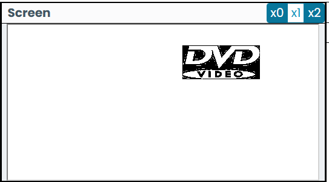

# DVD Logo Project

This project is a graphical simulation of the classic bouncing DVD logo screensaver, implemented in the Jack programming language.

## Overview

The application creates a DVD logo sprite that moves across the screen and bounces off the edges. It demonstrates direct memory manipulation for graphics rendering and basic physics for movement.

## Implementation Details

The project consists of two main classes:

### 1. `DVDLogo` Class
This class encapsulates the properties and behaviors of the DVD logo object.

*   **State Management**: It maintains the current position (`top`, `left`) and velocity (`verticalSpeed`, `horizontalSpeed`) of the logo.
*   **Rendering (`draw` method)**: The most complex part of the class. It renders the DVD logo bitmap directly to the screen's memory map using `Memory.poke`. This allows for drawing a custom, complex shape that isn't a standard geometric primitive. The bitmap data is hardcoded as a series of 16-bit integers poked into specific memory addresses calculated relative to the logo's position.
*   **Animation (`hide` method)**: Clears the logo from its current position by writing zeros to the same memory locations used in `draw`.
*   **Physics (`move` method)**: Updates the logo's position based on its speed. It checks for collisions with the screen boundaries (0-511 horizontal, 0-255 vertical) and reverses the corresponding speed component to simulate a "bounce" effect.

### 2. `Main` Class
The entry point of the program. It sets up the animation loop:

1.  Initialize a new `DVDLogo` instance.
2.  Enter an infinite loop:
    *   **Draw** the logo at the current position.
    *   **Wait** for a short duration (`Sys.wait(2)`) to control the frame rate.
    *   **Hide** the logo (clear previous frame).
    *   **Move** the logo to the next position.

## Key Concepts
*   **Direct Memory Access**: Writing directly to the screen memory map (starting at address 16384) to render custom graphics.
*   **Animation Loop**: The classic "Draw -> Wait -> Clear -> Update" cycle used in game development and graphics programming.
