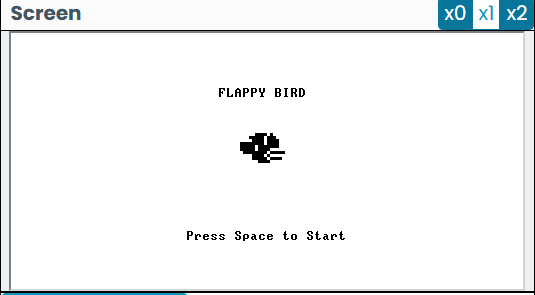
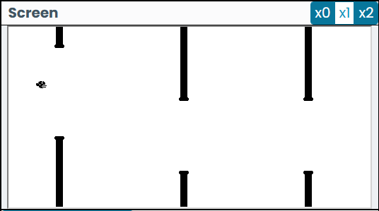
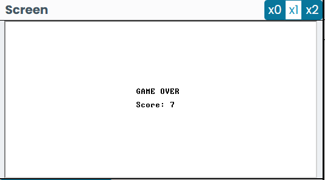

# Flappy Bird for Hack Platform

A complete implementation of the popular Flappy Bird game for the Nand2Tetris Hack computer platform, written in Jack.

## Screenshots

### Start Screen

### Gameplay

### Game Over

## Overview

This project recreates the addictive gameplay of Flappy Bird. The player controls a bird, attempting to fly between columns of green pipes without hitting them.

## Controls
*   **Spacebar**: Flap (Jump)
*   **Esc**: Quit (during gameplay)

## Implementation Details

The game is structured around a main controller class and several helper classes for game objects and states.

### Core Classes

*   **`Flappy` (Game Controller)**:
    *   **State Management**: Manages the transition between the Start Screen, Main Game Loop, and Game Over Screen.
    *   **Pipe Management**: Maintains an array of 8 `Pipe` objects (4 pairs). It handles the recycling of pipes—once a pipe moves off the left side of the screen, it is reset to the right side with a new height.
    *   **Collision Detection**: Checks every frame if the bird has collided with the ground, ceiling, or any of the active pipes.
    *   **Procedural Generation**: The `pipeGenerator` method uses a pseudo-random algorithm based on the bird's current position to select the gap height for the next pipe, ensuring variety in gameplay.

*   **`Bird`**:
    *   **Physics**: Implements simple gravity. The bird has a constant downward velocity that is counteracted by a "jump" velocity when the player presses Space.
    *   **Rendering**: Draws the bird sprite using direct memory manipulation (`Memory.poke`) to create a custom bitmap image, rather than simple geometric shapes.

*   **`Pipe`**:
    *   Represents a single pipe segment (upper or lower).
    *   Handles its own movement and rendering.

*   **`Start` & `GameOver`**:
    *   Handle the display of the UI screens and wait for user input to begin or restart the game.

## Key Challenges & Solutions
*   **Performance**: To ensure smooth 60FPS-like movement on the Hack platform, the game minimizes full screen redraws. Instead, it selectively clears and redraws only the moving objects (bird and pipes).
*   **Memory Management**: The game carefully manages object allocation, reusing the same 8 pipe objects throughout the session to avoid memory leaks or garbage collection overhead.
